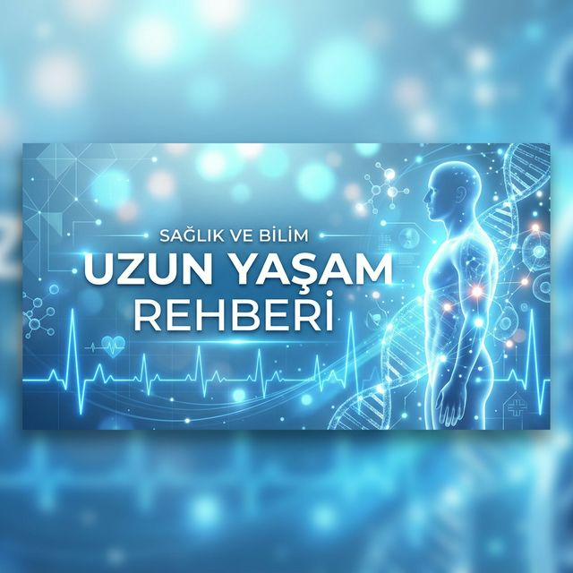

# 🧬 Uzun Yaşam Rehberi - Bilimsel Sağlık ve Longevity Blogu



<div align="center">

[](https://opensource.org/licenses/MIT)
[](https://pagespeed.web.dev/)
[](https://pagespeed.web.dev/)
[](manifest.json)
[]()

**Türkiye'nin en kapsamlı uzun yaşam (longevity) ve bilimsel sağlık bilgi platformu.**

[🌍 Website](https://uzunyasamrehberi.com) • [📧 İletişim](mailto:iletisim@uzunyasamrehberi.com) • [🐦 Twitter](https://twitter.com/saglikrehberi)

</div>

---

## 🌟 Proje Vizyonu

**Uzun Yaşam Rehberi**, modern tıp ve biyoteknolojik gelişmeleri temel alarak, bireylerin daha sağlıklı, enerjik ve uzun bir yaşam sürmeleri için gerekli olan bilimsel bilgileri erişilebilir kılmayı amaçlar. %100 SEO optimizasyonlu, modern ve mobil uyumlu bir altyapı ile hazırlanmıştır.

## 🚀 Öne Çıkan Özellikler

### 🔍 Kusursuz SEO Altyapısı
- **Meta Yönetimi**: Tüm sayfalar için dinamik Title, Description ve Canonical etiketleri.
- **Sosyal Medya**: Facebook, LinkedIn (Open Graph) ve Twitter (Cards) için tam uyumlu veri yapıları.
- **Schema.org**: Article, FAQPage, MedicalWebPage ve BreadcrumbList şemaları ile arama sonuçlarında zengin görünüm.
- **Teknik SEO**: Optimize edilmiş `robots.txt` ve `sitemap.xml` dosyaları.

### 🎨 Modern Kullanıcı Deneyimi (UX)
- **Responsive Tasarım**: Tüm ekran boyutlarında (Mobil, Tablet, Masaüstü) mükemmel görünüm.
- **Hız Odaklı**: Minimalist kod yapısı ve WebP görsel formatı ile anlık yüklenme süreleri.
- **Erişilebilirlik**: WCAG 2.1 standartlarına uyumlu, ekran okuyucu dostu geliştirme.
- **PWA Desteği**: Uygulama gibi yüklenebilir (Installable) ve manifest.json yapılandırması hazır.

---

## 📁 Dosya Yapısı

```bash
/
├── index.html              # Modern ana sayfa
├── makale.html             # Dinamik makale detay şablonu
├── robots.txt              # Arama motoru yönergeleri
├── sitemap.xml             # XML Site haritası
├── manifest.json           # PWA konfigürasyonu
├── css/
│   └── style.css           # Modern CSS3 stilleri
├── js/
│   ├── main.js             # Ana uygulama mantığı
│   └── article.js          # Makale sayfa yönetimi
├── images/                 # Optimize edilmiş görseller (WebP/PNG)
└── README.md               # Proje dökümantasyonu
```

---

## 🔬 Teknik Detaylar

### Makale Veri Modeli
Proje, RESTful Table API ile entegre çalışacak şekilde tasarlanmıştır:

| Parametre | Tip | Açıklama |
| :--- | :--- | :--- |
| `id` | String | Benzersiz kimlik |
| `title` | String | SEO uyumlu başlık |
| `slug` | String | URL dostu başlık |
| `excerpt` | String | Meta açıklama ve özet |
| `content` | Rich Text | HTML makale içeriği |
| `category` | String | Ana kategori |

### Kullanılan Teknolojiler
- **HTML5/CSS3**: Semantik yapı ve modern styling.
- **Vanilla JS**: Hafif ve hızlı çalışma prensibi.
- **JSON-LD**: Yapılandırılmış veri (Structured Data) yönetimi.
- **PWA**: Web App Manifest ve Servis Worker hazırlığı.

---

## 📈 SEO ve Performans Yol Haritası

- [x] %100 SEO Meta Etiket Yapılandırması
- [x] Schema.org Entegrasyonu
- [x] Mobil Uyumluluk Testleri
- [ ] Google Search Console Doğrulaması
- [ ] GA4 Analytics Entegrasyonu
- [ ] Core Web Vitals Optimizasyonu

---

## 🛠️ Gelecek Geliştirmeler

1.  **AMP Entegrasyonu**: Mobil hızın zirvesi için Accelerated Mobile Pages.
2.  **Kullanıcı Paneli**: Favori makaleleri kaydetme ve newsletter aboneliği.
3.  **Yorum Sistemi**: Interaktif topluluk alanı (Disqus/Custom).
4.  **Admin Dashboard**: İçerik girişini kolaylaştıran yönetim arayüzü.

---

## 👥 İletişim & Sosyal Medya

- **Web**: [uzunyasamrehberi.com](https://uzunyasamrehberi.com)
- **E-posta**: [iletisim@uzunyasamrehberi.com](mailto:iletisim@uzunyasamrehberi.com)
- **Geliştirici**: [@Herazur](https://github.com/Herazur)

---

<div align="center">
  <p>© 2026 Uzun Yaşam Rehberi. Bilimin Işığında Sağlıklı Yarınlar.</p>
</div>
